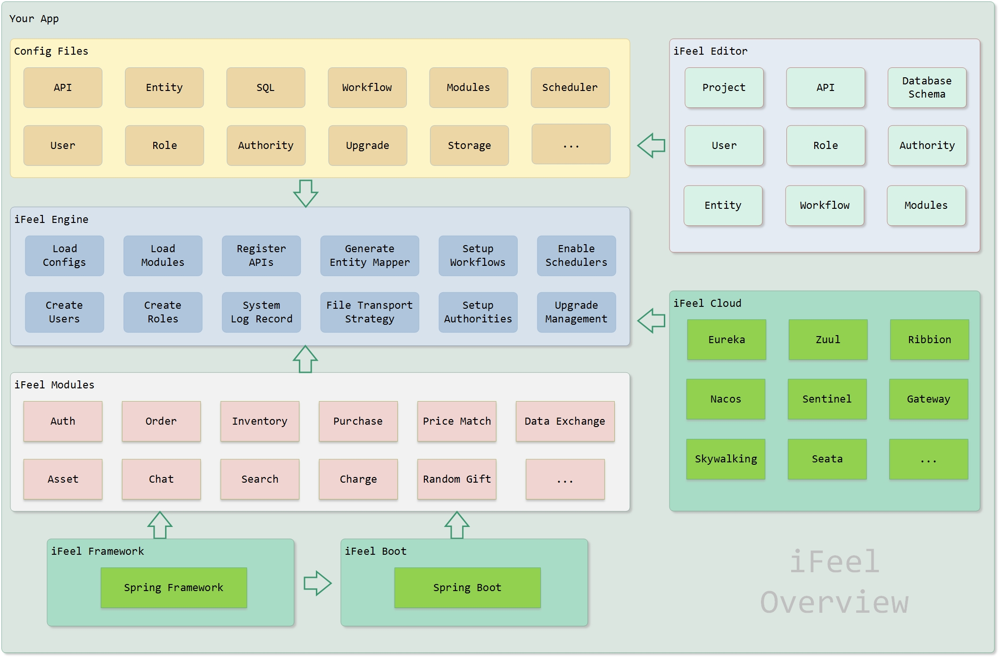

#  iFeel Framework

iFeel Framework is based on the Spring Framework, to enhance and extend it for the flexible Internet business demand. The developer could make more powerful business application by a more flexible way in iFeel Framework. like configuration files, remote configuration centers, asynchronous MQ event drivers, etc.

iFeel Framework developed in JDK 11, provide a flexible and extensive development solution, specifically for the complex and variable enterprise-level business platform. 

------

## iFeel Overview

------